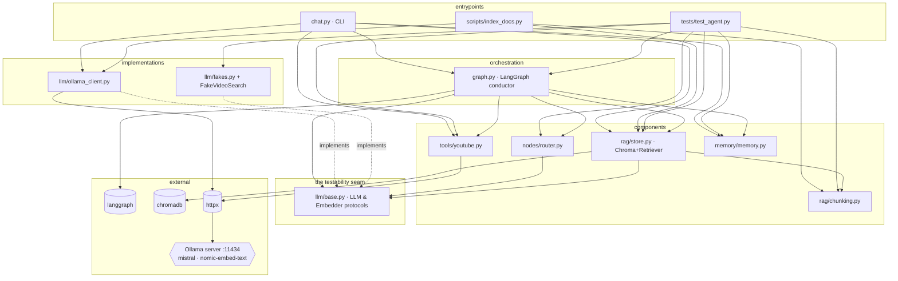
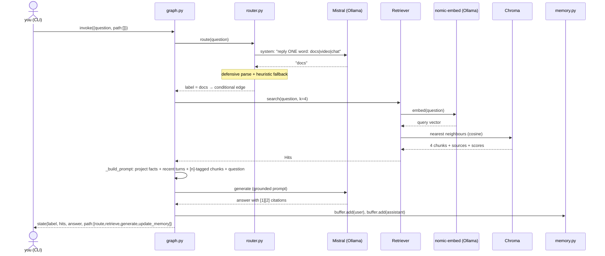

# How it all works together

One question's complete journey through every file, plus the dependency map.
(Companion to the README's glossary table — that tells you what each term
*means*; this tells you how they *cooperate*.)

## The cast, in one line each

| File | Role | Depends on |
|---|---|---|
| `copilot/chat.py` | CLI: wires everything, prints path/citations | graph, llm, rag, tools, memory |
| `copilot/graph.py` | **The conductor** — LangGraph nodes/edges, prompt assembly | langgraph, all components below |
| `copilot/nodes/router.py` | classify question → `docs` / `video` / `chat` | llm/base only |
| `copilot/rag/chunking.py` | split docs into overlapping ~400-word chunks | nothing (pure) |
| `copilot/rag/store.py` | Chroma vector DB + Retriever (embed → nearest chunks) | chromadb, llm/base, chunking |
| `copilot/llm/base.py` | **The seam** — `LLM` & `Embedder` protocols | nothing (pure) |
| `copilot/llm/ollama_client.py` | real inference: Mistral + nomic-embed via HTTP :11434 | httpx |
| `copilot/llm/fakes.py` | deterministic doubles for tests | nothing (pure) |
| `copilot/tools/youtube.py` | key-less video search (parse `ytInitialData`) | httpx |
| `copilot/memory/memory.py` | short-term buffer + long-term JSON facts | nothing (pure) |
| `scripts/index_docs.py` | one-time indexing: fetch → chunk → embed → store | httpx, chunking, store, ollama |
| `tests/test_agent.py` | runs the WHOLE graph against the fakes | everything + fakes |

## Module dependency graph

Arrows mean "imports". Notice the shape: everything meets at the **protocols**
(`llm/base.py`), never at Ollama directly — that inversion is what lets tests
substitute fakes without touching a single production file.

## Timeline A — before any question: indexing (one-time)

`scripts/index_docs.py` is the **Indexing** step from the glossary:

1. reads `corpus/urls.txt` (12 frameworks' real doc pages);
2. `httpx` downloads each page; a small regex pass strips HTML to text;
3. `chunking.chunk_text` cuts it into overlapping **chunks** (~400 words,
   paragraph-aligned, 60-word overlap so no idea is sliced in half);
4. `OllamaEmbedder.embed` turns each chunk into an **embedding** — one HTTP
   call per chunk to `nomic-embed-text`;
5. `Retriever.add` writes ids + vectors + texts + `{source}` metadata into
   **Chroma** (`chroma_db/` on disk, cosine space).

Result: 226 chunks the agent can search by *meaning*. This runs once; the
chat never fetches docs at question time.

## Timeline B — one question, end to end

`you> how do I make my player collide with a tilemap layer?`

Step by step, with the glossary terms doing their jobs:

1. **CLI** (`chat.py`) has already built the object graph at startup and
   `Copilot.__post_init__` (`graph.py`) compiled the **LangGraph**: nodes
   `route / retrieve / search_video / generate / update_memory`, a
   **conditional edge** out of `route`, plain edges elsewhere.
2. **Router node** (`nodes/router.py`) makes the *first* Mistral call — pure
   classification. Messy output ("I think this is docs…") is salvaged; garbage
   falls back to a keyword heuristic. The graph branches on the label — this
   is the only decision the LLM makes about *control flow*, and even that is
   fenced.
3. **Retriever** (`rag/store.py`) embeds the *question* with the same model
   that embedded the chunks (they must share a vector space!), asks Chroma
   for the nearest neighbours, and returns `Hit(text, source, score)` —
   source powers the `[1] docs.phaser.io/... (score 0.71)` lines you see.
4. **Prompt assembly** (`graph.py::_build_prompt`) stacks, in order:
   **long-term memory** (`ProjectMemory.render()` — your `/remember` facts,
   *always* injected), **short-term memory** (`ConversationBuffer.render()` —
   the last 8 turns, which is how "that jump" resolves), the **retrieved
   chunks** tagged `[1]..[4]` with an instruction to answer FROM them and
   admit gaps (the anti-**hallucination** contract), and finally your
   question.
5. **Generate** — the second Mistral call. ~60–90 s on CPU: that's **local
   inference**, the price of free + private.
6. **update_memory** appends both turns to the buffer (oldest fall off —
   that's the context-management triage), and the graph reaches END. The CLI
   prints `state["path"]` — the trace of nodes that actually ran.

Had the router said `video`, the branch would instead run the **tool**
(`tools/youtube.py`): our code — never the model — performs the real search
(fetch results page, parse the `ytInitialData` JSON), and the found videos
are fed back into the generate prompt. Had it said `chat`, generate runs with
memory only. Same conductor, three routes, one visible path.

## Why the tests can run all of this in one second

`llm/base.py` defines two tiny protocols; `graph.py` only ever sees those.
So `tests/test_agent.py` builds the identical `Copilot` with `FakeLLM`
(scripted answers, records every prompt), `HashEmbedder` (stable
bag-of-words vectors — real cosine math, zero models) and `FakeVideoSearch`
— then asserts on `state["path"]`, on the *grounding* (retrieved text really
appears inside the recorded generate prompt), on memory persistence, and on
router salvage. Swapping fakes→Ollama changes the words, never the wiring —
which is the whole point of putting the seam where it is.
