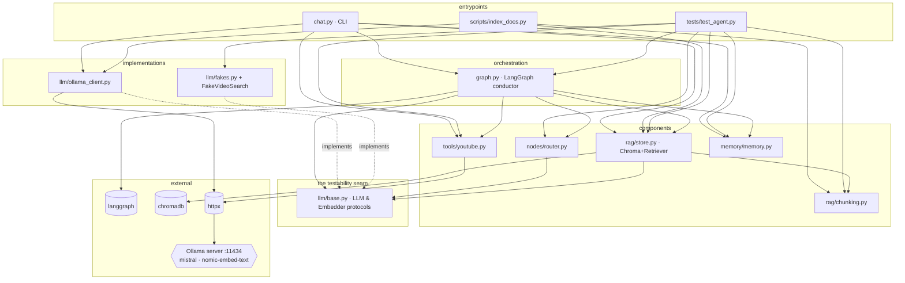
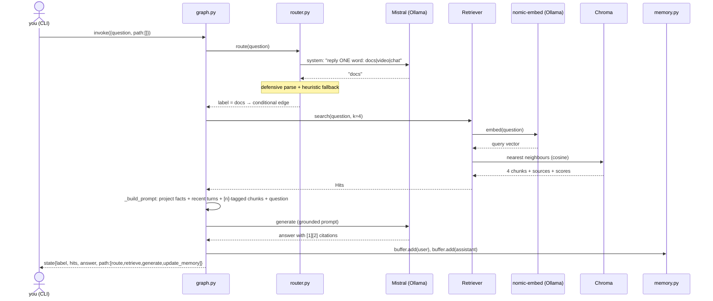

# 🔬 research-copilot

**A local research copilot for ANY subject** — a LangGraph agent that decides
whether to answer from indexed docs (RAG), find you a tutorial video, or just
chat — with **every LLM call running locally** (Ollama + Mistral) and every
architectural concept mapped to one readable file.

The subject is **configuration, not architecture**: a small JSON profile
(persona, router keywords, docs corpus) points the same graph at anything.
The shipped demo profile is **2D game development** — 12 frameworks indexed
(Phaser, Godot, PixiJS, Ebitengine, Bevy + 7 more) — and
[`profiles/fastapi.json`](profiles/fastapi.json) shows a second subject
ready to index.

```
you> How do I make my player collide with a tilemap layer?

[path: route → retrieve → generate → update_memory]  [label: docs]
  [1] docs.phaser.io/api-documentation/class/tilemaps-tilemap  (score 0.71)
  [2] docs.phaser.io/phaser/concepts/physics/arcade            (score 0.66)

copilot> Use this.physics.add.collider(player, layer) after
layer.setCollisionByExclusion([-1]) … [1][2]
```

---

## 🚀 From a fresh PC to a working copilot

Every command, in order, on a clean Windows machine (PowerShell):

```powershell
# 1. Tooling (skip any you already have)
winget install Git.Git
winget install Python.Python.3.12
winget install Ollama.Ollama
# → close and reopen the terminal so PATH updates

# 2. Get the code
git clone https://github.com/jonathanDavid/research-copilot.git
cd research-copilot

# 3. Python environment + dependencies
python -m venv .venv
.venv\Scripts\pip install -r requirements.txt

# 4. Prove the architecture works BEFORE any model exists (hermetic tests)
.venv\Scripts\python -m pytest        # 20 passed, ~4s — no Ollama needed

# 5. The local models (~4.7 GB total, one-time download)
ollama pull mistral                    # the 7B chat model
ollama pull nomic-embed-text           # the embedding model
# (if "connection refused": run `ollama serve` in another terminal first)

# 6. Build the knowledge — index 12 frameworks' real doc pages (one-time, ~3 min)
.venv\Scripts\python scripts\index_docs.py    # → 226 chunks into .\chroma_db

# 7. Chat
.\chat.bat                             # PowerShell/cmd (auto-starts Ollama)
# or from Git Bash:  ./chat.sh
# or directly:       .venv\Scripts\python -m copilot.chat
```

Inside the REPL: `/remember <fact>` · `/facts` · `/forget <n>` · `/quit`.
Linux/macOS is the same story: install git/python3/ollama with your package
manager, use `.venv/bin/` instead of `.venv\Scripts\`.

### Just tell it the subject

Launch with no arguments and the chat asks:

```
What should I be an expert on? (Enter = 2D game development demo) Svelte
  searching the web for 'Svelte' documentation…
  official-looking docs: https://svelte.dev/docs
  crawled 12 pages — writing profile + indexing
✓ now an expert on Svelte — indexed 22 chunks from 12 pages
```

Or switch mid-conversation — `I want you to be an expert in Rust` (also
Spanish: `quiero que seas experto en …`) or `/subject Rust`. An agent
searches the web (key-less DuckDuckGo scrape, same philosophy as the
YouTube tool), picks the site that looks like official documentation,
crawls a bounded set of same-host pages, writes the profile, and indexes —
then your questions are answered from that corpus, with citations.

### Or hand-curate a profile

Everything subject-specific lives in one `DomainProfile`
([`copilot/domain.py`](copilot/domain.py)) — six JSON fields (see
[`profiles/fastapi.json`](profiles/fastapi.json)): `name`, `banner`,
`persona`, `docs_keywords`, `urls_file`, `index_dir`. Index and chat with
it explicitly:

```powershell
.venv\Scripts\python scripts\index_docs.py profiles\fastapi.json
.\chat.bat profiles\fastapi.json          # or: ./chat.sh profiles/fastapi.json
```

Each subject keeps its **own vector index** (`index_dir`), so corpora never
mix. `COPILOT_DOMAIN=profile.json` works too; with neither, the game-dev
demo profile applies. Auto-discovered subjects write these same files — a
discovery run is just a curated profile you didn't have to type.

> Expectations: docs answers take **60–90 s** — that's a 7B model doing real
> inference on your CPU. Private and free is the trade.

---

## Learn the vocabulary by reading the code

Each agent concept lives in ONE small file with a `GLOSSARY` docstring:

| Term | What it means (short) | Read this file |
|---|---|---|
| **Domain profile** | the ONE place a subject lives — persona, keywords, corpus; swap it and the agent researches anything | [`copilot/domain.py`](copilot/domain.py) |
| **Router node** | classification only: `docs` / `video` / `chat`, graph branches on it | [`copilot/nodes/router.py`](copilot/nodes/router.py) |
| **Indexing** | one-time prep: split + store docs before any question | [`scripts/index_docs.py`](scripts/index_docs.py) |
| **Chunks** | ~400-word passages — models retrieve better over small focused pieces | [`copilot/rag/chunking.py`](copilot/rag/chunking.py) |
| **Embeddings** | text → vector of numbers capturing *meaning* | [`copilot/llm/base.py`](copilot/llm/base.py) |
| **Chroma (vector DB)** | stores embeddings, answers "closest chunks to this query?" in ms | [`copilot/rag/store.py`](copilot/rag/store.py) |
| **Retriever** | embed question → ask Chroma → return top chunks | [`copilot/rag/store.py`](copilot/rag/store.py) |
| **Hallucination** | model invents an API; RAG grounds answers in retrieved text + citations | prompt in [`copilot/graph.py`](copilot/graph.py) |
| **Inference / local inference** | running the model; here on YOUR machine via Ollama | [`copilot/llm/ollama_client.py`](copilot/llm/ollama_client.py) |
| **Ollama / Mistral** | local model server / the 7B model it serves | [`copilot/llm/ollama_client.py`](copilot/llm/ollama_client.py) |
| **Tool / tool call** | the LLM can't execute anything — our code runs the real YouTube search and feeds results back | [`copilot/tools/youtube.py`](copilot/tools/youtube.py) |
| **Conversation buffer** | models remember nothing — recent turns are re-sent every call | [`copilot/memory/memory.py`](copilot/memory/memory.py) |
| **Long-term memory / context management** | durable facts ("Phaser 3 + arcade physics") always injected; old chatter dropped | [`copilot/memory/memory.py`](copilot/memory/memory.py) |
| **Graph / nodes / edges** | explicit workflow you can see and debug — vs a freeform agent | [`copilot/graph.py`](copilot/graph.py) |

Suggested reading order: `router.py` → `chunking.py` → `store.py` →
`graph.py` → `memory.py` → `fakes.py`.

---

# Architecture — how it all works together

## The cast, in one line each

| File | Role | Depends on |
|---|---|---|
| `copilot/chat.py` | CLI: wires everything, prints path/citations | graph, llm, rag, tools, memory |
| `copilot/graph.py` | **The conductor** — LangGraph nodes/edges, prompt assembly | langgraph, all components below |
| `copilot/domain.py` | the subject as data: persona, keywords, corpus, banner | nothing (pure) |
| `copilot/nodes/router.py` | classify question → `docs` / `video` / `chat` | llm/base only |
| `copilot/rag/chunking.py` | split docs into overlapping ~400-word chunks | nothing (pure) |
| `copilot/rag/store.py` | Chroma vector DB + Retriever (embed → nearest chunks) | chromadb, llm/base, chunking |
| `copilot/llm/base.py` | **The seam** — `LLM` & `Embedder` protocols | nothing (pure) |
| `copilot/llm/ollama_client.py` | real inference: Mistral + nomic-embed via HTTP :11434 | httpx |
| `copilot/llm/fakes.py` | deterministic doubles for tests | nothing (pure) |
| `copilot/tools/youtube.py` | key-less video search (parse `ytInitialData`) | httpx |
| `copilot/memory/memory.py` | short-term buffer + long-term JSON facts | nothing (pure) |
| `scripts/index_docs.py` | one-time indexing: fetch → chunk → embed → store | httpx, chunking, store, ollama |
| `tests/test_agent.py` | runs the WHOLE graph against the fakes | everything + fakes |

## Module dependency graph

Arrows mean "imports". Notice the shape: everything meets at the **protocols**
(`llm/base.py`), never at Ollama directly — that inversion is what lets tests
substitute fakes without touching a single production file.



## Timeline A — before any question: indexing (one-time)

`scripts/index_docs.py` is the **Indexing** step from the glossary:

1. reads `corpus/urls.txt` (12 frameworks' real doc pages);
2. `httpx` downloads each page; a small regex pass strips HTML to text;
3. `chunking.chunk_text` cuts it into overlapping **chunks** (~400 words,
   paragraph-aligned, 60-word overlap so no idea is sliced in half);
4. `OllamaEmbedder.embed` turns each chunk into an **embedding** — one HTTP
   call per chunk to `nomic-embed-text`;
5. `Retriever.add` writes ids + vectors + texts + `{source}` metadata into
   **Chroma** (`chroma_db/` on disk, cosine space).

Result: 226 chunks the agent can search by *meaning*. This runs once; the
chat never fetches docs at question time.

## Timeline B — one question, end to end

`you> how do I make my player collide with a tilemap layer?`



Step by step, with the glossary terms doing their jobs:

1. **CLI** (`chat.py`) has already built the object graph at startup and
   `Copilot.__post_init__` (`graph.py`) compiled the **LangGraph**: nodes
   `route / retrieve / search_video / generate / update_memory`, a
   **conditional edge** out of `route`, plain edges elsewhere.
2. **Router node** (`nodes/router.py`) makes the *first* Mistral call — pure
   classification. Messy output ("I think this is docs…") is salvaged; garbage
   falls back to a keyword heuristic. This is the only place the LLM touches
   *control flow*, and even that is fenced.
3. **Retriever** (`rag/store.py`) embeds the *question* with the same model
   that embedded the chunks (they must share a vector space!), asks Chroma
   for the nearest neighbours, and returns `Hit(text, source, score)` —
   source powers the `[1] docs.phaser.io/... (score 0.71)` lines you see.
4. **Prompt assembly** (`graph.py::_build_prompt`) stacks, in order:
   **long-term memory** (`ProjectMemory.render()` — your `/remember` facts,
   *always* injected), **short-term memory** (`ConversationBuffer.render()` —
   the last 8 turns, which is how "that jump" resolves), the **retrieved
   chunks** tagged `[1]..[4]` with an instruction to answer FROM them and
   admit gaps (the anti-**hallucination** contract), and finally your
   question.
5. **Generate** — the second Mistral call. ~60–90 s on CPU: that's **local
   inference**, the price of free + private.
6. **update_memory** appends both turns to the buffer (oldest fall off —
   that's the context-management triage), and the graph reaches END. The CLI
   prints `state["path"]` — the trace of nodes that actually ran.

Had the router said `video`, the branch would instead run the **tool**
(`tools/youtube.py`): our code — never the model — performs the real search
(fetch results page, parse the `ytInitialData` JSON), and the found videos
are fed back into the generate prompt. Had it said `chat`, generate runs with
memory only. Same conductor, three routes, one visible path.

## Testable without any model — the core design decision

`llm/base.py` defines two tiny protocols; `graph.py` only ever sees those:

| Real | Fake (tests) |
|---|---|
| `OllamaLLM` (Mistral) | `FakeLLM` — scripted responses, records every prompt |
| `OllamaEmbedder` (nomic-embed-text) | `HashEmbedder` — stable bag-of-words vectors, real cosine ranking |
| `YouTubeSearch` (live scrape) | `FakeVideoSearch` — canned videos, records queries |
| Persistent Chroma | Ephemeral Chroma (unique per-test collections) |

**20 hermetic tests run the entire graph in seconds with zero network and
zero models** — asserting the path taken, the *grounding* (retrieved chunk
text really appears inside the recorded generate prompt), memory injection
and persistence, router salvage of messy output, the YouTube parser against
fixture data, that a custom DomainProfile reskins every prompt (an
astronomy profile produces an astronomy copilot, no game-dev residue), and
that weakly-matching retrieval injects an explicit admit-the-gap demand
(measured live: a 7B otherwise summarizes the wrong docs instead of
saying the index doesn't cover the topic). Swapping fakes→Ollama changes the words, never the
wiring — which is the whole point of putting the seam where it is.

---

## Honesty notes

- **7B is 7B**: even grounded, Mistral occasionally paraphrases an API
  imprecisely — the citations exist precisely so you check the source.
- The YouTube tool scrapes the public results page (key-less by design);
  markup changes degrade it to empty results, never a crash.
- The corpus ([`corpus/urls.txt`](corpus/urls.txt)) covers 12 frameworks:
  Phaser (deep) plus PixiJS, Excalibur, Kaplay, Godot, Pygame, MonoGame,
  libGDX, Ebitengine, Bevy, raylib. Some sites can't be indexed honestly:
  melonJS/deep-PixiJS pages are client-rendered SPAs (a fetcher receives an
  empty shell) and love2d.org blocks non-browser agents — noted in the file.

## What I'd change at scale

- Answer streaming (Ollama supports it) for perceived latency.
- A golden-set retrieval eval (query → expected source) run in CI.
- Web UI that renders the graph path visually; recorded-transcript demo mode
  for GitHub Pages (local inference can't run there).
- Summarization node when the buffer overflows, instead of plain drop-off.
